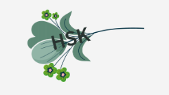
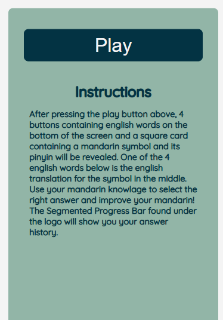
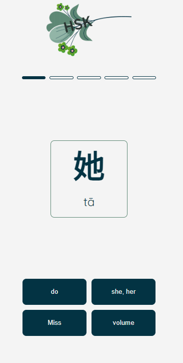
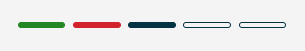
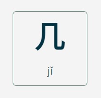
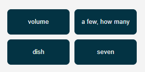

# HSKone

Introducing HSKone, your solution to mastering Mandarin Chinese HSK1
vocabulary. HSKone is a user-friendly website designed to help learn Mandarin
Chinese vocabulary through interactive exercises. Our platform is specifically
tailored for individuals who are seeking to learn the basics of the Chinese language,
particularly HSK1 vocabulary.

## Features

### Existing Features

 - __HSKone Logo__

    - The HSKOne logo is clearly visible at the top of the page.

 - __Game Menu__

    - The games starting menu that allows the user to start the game using the "play" button.
    - Includes instructions on how the game is played.

 - __Game Area__

    - All gameplay related elements and interactions are contained in this area.
    - The user will be given 4 options to choose from and has to correctly choose which one is the correct translation of the symbol in the middle / word card.

 - __Progress Bar__

    - The progress reflects information about how many rounds the user played and what their outcome was.
    - It displays each round as a segment where a filled in segment is the current round being played and a empty ones are rounds left to play.
    - Rounds where finished will have either a green or a red color depending on wheter the user answered correctly or not.

 - __Word Card__

    - The word card contains both the hanzi and the pinyin of the character being tested.
    - It is placed in the middle of the screen and enlarged to make sure it stands out and is readable.
    - When a answer is submited the card border will change color to either red or green to make the result clearer.

 - __Answer Buttons__

    - The answer buttons area is where the user interacts with the game to answer the question.
    - It offers 4 buttons with pregenerated answers where 1 is correct and 3 are random.
    - After clicking one of the buttons the user will recieve feedback in form of the correct button turning green and the rest red.
    - The buttons are in a state of "inactive" until the game starts which blocks the user from interacting with them and grays them out.

### Features Left to Implement

 - __Tutorial__

    - A prompt that asks first time visiters if they want a tutorial.
    - If the user agrees to a tutorials then the prompt changes to a tooltip that explains certain features.
    - If the user declines it will simply hide the prompt.

## Testing

### Validator Testing

 - HTML
   - There were no errors found using the offical [W3C validator]("https://validator.w3.org/nu/?doc=https%3A%2F%2Fdebuggedmoon.github.io%2Fhsk-one%2F").
 - CSS
   - There were no errors found using the offical [Jigsaw validator]("https://jigsaw.w3.org/css-validator/validator?uri=https%3A%2F%2Fdebuggedmoon.github.io%2Fhsk-one%2F&profile=css3svg&usermedium=all&warning=1&vextwarning=&lang=en").
 - JavaScript
   - There were no errors found using the offical [Jshint validator]("https://jshint.com/").

### Unfixed Bugs

## Deployment

## Credits

### Content

### Media

